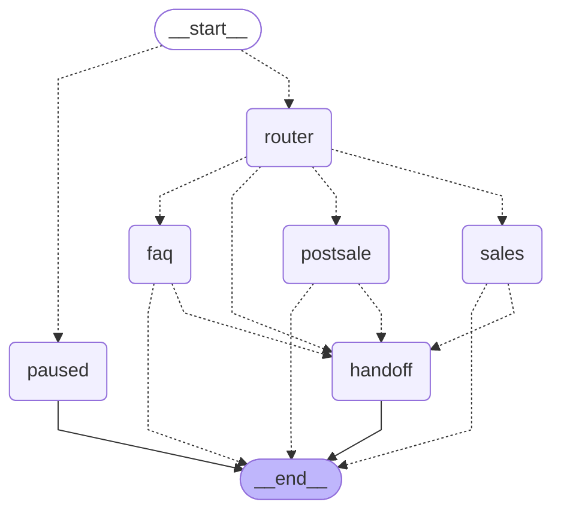

# Grafo del agente

```mermaid
---
config:
  flowchart:
    curve: linear
---
graph TD;
	__start__([<p>__start__</p>]):::first
	router(router)
	sales(sales)
	postsale(postsale)
	faq(faq)
	handoff(handoff)
	paused(paused)
	__end__([<p>__end__</p>]):::last
	__start__ -.-> paused;
	__start__ -.-> router;
	faq -.-> __end__;
	faq -.-> handoff;
	postsale -.-> __end__;
	postsale -.-> handoff;
	router -.-> faq;
	router -.-> handoff;
	router -.-> postsale;
	router -.-> sales;
	sales -.-> __end__;
	sales -.-> handoff;
	handoff --> __end__;
	paused --> __end__;
	classDef default fill:#f2f0ff,line-height:1.2
	classDef first fill-opacity:0
	classDef last fill:#bfb6fc
```
